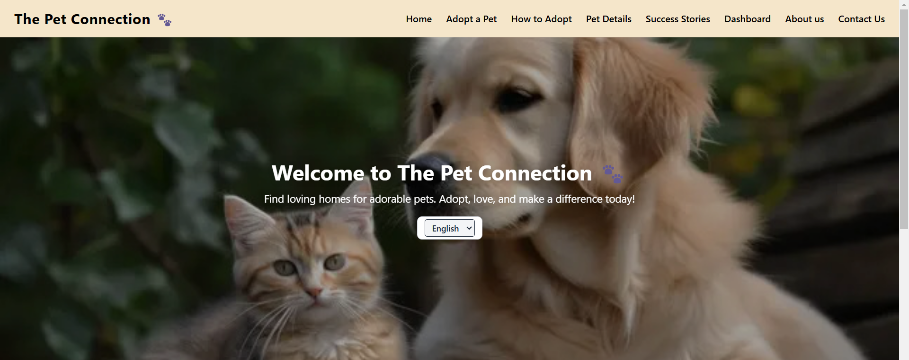

# The Pet Connection

## Description
This project is a React application that provides detailed views of pets.

## Installation
1. Clone the repository: `git clone <repository-url>`
2. Navigate to the project directory: `cd ICP9-G2-React-Project`
3. Install the dependencies: `npm install`

## Usage
To start the application, run: `npm run dev`

## Screenshot

## Contributors
- **Home Page** - Amruta Maskar
- **User Dashboard** - Gitanjali Sase
- **Contact Us** - Juned Ansari
- **How to Adopt** - Bhakti Dethe
- **About Us** - Samiksha Wagaj
- **Pet Details** - Abhishek Ugalmugale
- **Adopt a Pet** - Yash Yeole
- **Success Story Page** - Tosif

Website: [Pet Adoption Website](https://thepetadoptionwebsiteicp9.netlify.app/)
